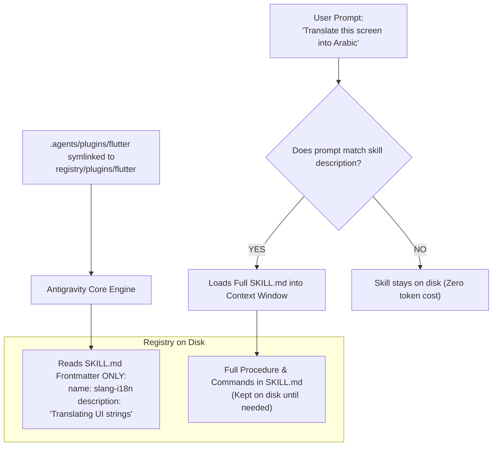
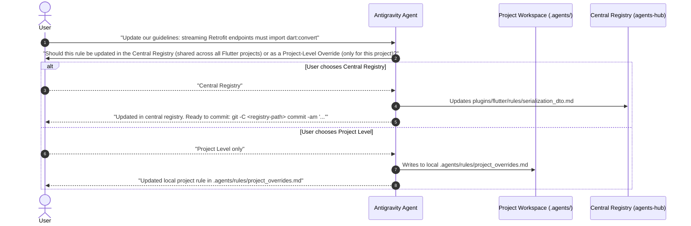

# Agents Hub — Architecture & Customization Engine Reference

This document provides a deep architectural breakdown of the **Agents Hub** Central Registry, explaining how Antigravity 2.0 discovers rules, manages stack plugins, executes progressive skills, and maintains a clean feedback loop with downstream projects.

---

## 1. Central Registry Topology

Rather than treating agent customizations as isolated files within individual project repositories, Agents Hub manages them as a dedicated, version-controlled repository:

```text
agents-hub/
├── core/                                # Universal base standards (Git workflow, clean code, AI behavior)
│   ├── plugin.json                      # Core manifest marker
│   ├── rules/
│   │   ├── ai_agent_behavior.md
│   │   └── git_workflow.md
│   └── skills/
│       └── code-review/
│           └── SKILL.md
│
├── plugins/                             # Stack-specific Antigravity bundles
│   ├── flutter/
│   │   ├── plugin.json                  # Plugin manifest
│   │   ├── rules/                       # Modular rules auto-loaded when active
│   │   │   ├── 00_meta_rules.md         # Guidance on rule scoping & asking user preference
│   │   │   ├── clean_architecture.md    # Domain/Data/Presentation boundaries
│   │   │   ├── riverpod_standards.md    # Generator syntax, state rules, build() microtasks
│   │   │   ├── serialization_dto.md     # Freezed abstract classes, mapper patterns
│   │   │   ├── i18n_assets.md           # Slang and flutter_gen invariants
│   │   │   └── AGENTS.md                # Consolidated rule aggregator
│   │   └── skills/                      # Stack-specific progressive disclosure skills
│   │       ├── slang-i18n/
│   │       │   └── SKILL.md
│   │       └── flutter-gen/
│   │           └── SKILL.md
│   │
│   └── react/
│       ├── plugin.json
│       ├── rules/
│       │   ├── 00_meta_rules.md
│       │   ├── nextjs_conventions.md
│       │   ├── tailwind_conventions.md
│       │   └── AGENTS.md
│       └── skills/
│           └── tailwind-helper/
│               └── SKILL.md
│
└── skills/                              # Shared universal on-demand skills
    └── manage-guidelines/               # Skill enabling the agent to update registry rules
        ├── SKILL.md
        └── scripts/
            └── validate.js
```

---

## 2. Core Customization Units

| Customization Type | File Location | Activation Model | Primary Use Case |
| :--- | :--- | :--- | :--- |
| **Modular Rules** | `<plugin>/rules/*.md` | Always active when plugin is linked in `.agents/plugins/` | Hard architectural constraints, lint rules, layer invariants |
| **Skills** | `<plugin>/skills/<name>/SKILL.md` | Progressive disclosure (loaded on demand) | Multi-step runbooks, complex code generation workflows |
| **Plugins** | `<plugin>/plugin.json` | Direct symlink in `.agents/plugins/<name>` | Packaging rules, skills, hooks, and configs into one unit |

---

## 3. Progressive Disclosure Mechanics

To prevent overwhelming the model's context window, Antigravity uses **progressive disclosure**:



- **Skills** are not loaded into the context window by default. Only their `name` and `description` frontmatter fields are indexed into the system prompt.
- The full body, scripts, and reference documentation are loaded **only when the agent determines they are relevant to the user request**.
- **Rules** are deduplicated by resolved filesystem paths to prevent duplicate context injection.

---

## 4. In-Project Guideline Evolution & Scoping Protocol

When working inside a downstream project (e.g. `bayaan-2.0-mobile`), new architectural requirements frequently emerge. The agent must handle these updates interactively by asking the user to designate the proper scope:



---

## 5. Loading Priority and Precedence

When multiple customizations are discovered, they are loaded and applied in this specific order (from highest priority to lowest):

1. **Workspace Project**: Hierarchical discovery walking up from the current directory to the repository root (`.agents/rules/*.md`).
2. **Declared Configurations**: Customizations explicitly listed in `.agents/plugins.json` or `.agents/skills.json`.
3. **Global Discovery**: `~/.gemini/config/`
4. **Built-in Customizations**: Default skills bundled with the application.
