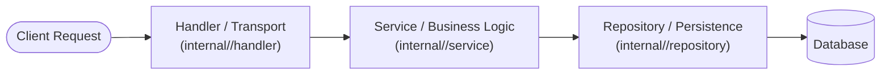

# Clean Architecture & Layer Boundaries

Architectural rules for Go backend services, enforcing domain packaging, strict 3-tier layer boundaries, and manual constructor dependency injection.

---

## 1. Directory Structure

```text
/cmd
  /server              # Application entrypoint & dependency wiring (main.go)

/internal
  /<domain>            # Domain-specific modules (e.g., auth, user, order)
    /handler           # Transport layer (HTTP REST handlers or gRPC servers)
    /service           # Pure business logic and domain rules
    /repository        # Database access and SQLC query wrappers
    /model             # Internal domain entities and domain error definitions

  /middleware          # Shared transport middleware (auth, logging, recovery)

/pkg                   # Shared reusable utilities (zero business logic)
```

---

## 2. 3-Tier Layer Responsibilities



| Layer | Responsibility | Allowed Dependencies | Forbidden |
| :--- | :--- | :--- | :--- |
| **Handler** | Unpack transport requests (HTTP/JSON or gRPC), validate input shapes, invoke service, write HTTP/gRPC response. | Domain Service interfaces, transport DTOs. | ❌ Database queries, SQL strings, business calculations. |
| **Service** | Pure business logic, authorization decisions, validation invariants, orchestration. | Domain Repository interfaces, external service clients, domain models. | ❌ Direct SQL, transport structs (e.g. `http.Request`, proto messages if abstracting). |
| **Repository** | Data persistence, transaction management, SQLC query execution, mapping DB rows to domain models. | Database handles (`*sql.DB`, `*pgxpool.Pool`), SQLC queries. | ❌ Business decision logic, authorization logic. |
| **Model** | Domain entities, value objects, domain-specific error types. | Pure Go standard library types. | ❌ Framework annotations, database drivers. |

---

## 3. Dependency Injection & Constructors

### ✅ Required Pattern: Manual Constructor Injection

Wire all dependencies explicitly through constructor functions (`New...`). Accept interfaces, return concrete structs or interfaces.

```go
package service

import "context"

type UserRepository interface {
    GetByID(ctx context.Context, id string) (*model.User, error)
    Create(ctx context.Context, user *model.User) error
}

type UserService struct {
    repo UserRepository
}

func NewUserService(repo UserRepository) *UserService {
    return &UserService{
        repo: repo,
    }
}
```

### ❌ Forbidden
* Global mutable state / singletons for repositories or services.
* Reflection-based DI frameworks (e.g. `dig`, `fx`) unless explicitly mandated by project architecture.
* Initializing database connections or downstream dependencies directly inside service methods.

---

## 4. Layer Boundary Code Invariants

### ✅ Correct Service Logic

```go
func (s *UserService) RegisterUser(ctx context.Context, email string, password string) (*model.User, error) {
    existing, err := s.repo.GetByEmail(ctx context.Context, email)
    if err == nil && existing != nil {
        return nil, model.ErrEmailAlreadyExists
    }
    
    hashedPassword, err := s.hasher.Hash(password)
    if err != nil {
        return nil, err
    }
    
    user := &model.User{
        ID:           s.idGen.NewID(),
        Email:        email,
        PasswordHash: hashedPassword,
    }
    
    if err := s.repo.Create(ctx, user); err != nil {
        return nil, err
    }
    return user, nil
}
```

### ❌ Forbidden Handler Logic

```go
// ❌ WRONG: Handler performing database access and business logic
func (h *UserHandler) Register(w http.ResponseWriter, r *http.Request) {
    var req RegisterRequest
    json.NewDecoder(r.Body).Decode(&req)
    
    // ❌ Direct DB query in transport layer
    var count int
    h.db.QueryRow("SELECT COUNT(*) FROM users WHERE email = $1", req.Email).Scan(&count)
    if count > 0 {
        http.Error(w, "Email exists", http.StatusConflict)
        return
    }
}
```
