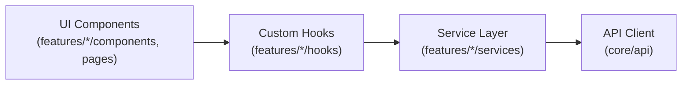

# Clean Architecture & Feature-Driven Structure

Architectural rules for React web applications, enforcing feature-based modularity, clear separation of concerns, and the critical unidirectional dependency rule.

---

## 1. Project Structure

```text
src/
  /app                 # Application setup (providers, router initialization, root layout)
  /core
    /api               # Centralized HTTP/API client (Axios/fetch wrappers, interceptors)
    /config            # Environment variables, feature flags, configuration
    /constants         # Global immutable constants and enum values
    /utils             # Pure general-purpose utility functions

  /features
    /<feature>         # Self-contained domain feature (e.g., auth, dashboard, billing)
      /components      # Feature-specific UI components
      /pages           # Route-level view components
      /hooks           # Feature-specific custom React hooks
      /services        # API client calls and response data transformers
      /state           # Local/feature state management (Zustand slices, reducers)

  /shared
    /components        # Generic, reusable UI primitives (Button, Modal, Input, Table)
    /hooks             # Generic reusable hooks (useDebounce, useMediaQuery)

  /styles              # Global styles, Tailwind base directives, typography
  main.tsx | index.tsx # React application entrypoint
```

---

## 2. Unidirectional Dependency Rule (CRITICAL)



### ✅ Allowed Flow
* **UI Components** call custom **Hooks**.
* **Hooks** orchestrate logic, state, and invoke **Services**.
* **Services** interact with the centralized **API Client** and transform response payloads.

### ❌ Strictly Forbidden
* ❌ Components calling API endpoints or `fetch()` / `axios` directly.
* ❌ Services importing React hooks, JSX, or component logic.
* ❌ Circular dependencies between features (if features need to share state or components, promote them to `/shared` or `/core`).

---

## 3. Service Layer Invariants

The service layer (`src/features/<feature>/services/` or `src/core/api/`) acts as the isolation barrier between network protocols and frontend logic:

* **Responsibilities**:
  1. HTTP/gRPC-Web communication via centralized API client.
  2. Data parsing, validation, and domain model mapping.
  3. Network error normalization.
* **Prohibitions**:
  * Must **NEVER** import React, hooks (`useState`, `useEffect`), or JSX.
  * Must be testable as pure TypeScript/JavaScript functions.

```typescript
// ✅ Good: Pure service function
import { apiClient } from '@/core/api/client';
import type { UserDto, User } from '../types';

export const userService = {
  async getProfile(userId: string): Promise<User> {
    const response = await apiClient.get<UserDto>(`/users/${userId}`);
    return {
      id: response.data.id,
      fullName: `${response.data.first_name} ${response.data.last_name}`,
      email: response.data.email,
    };
  },
};
```
