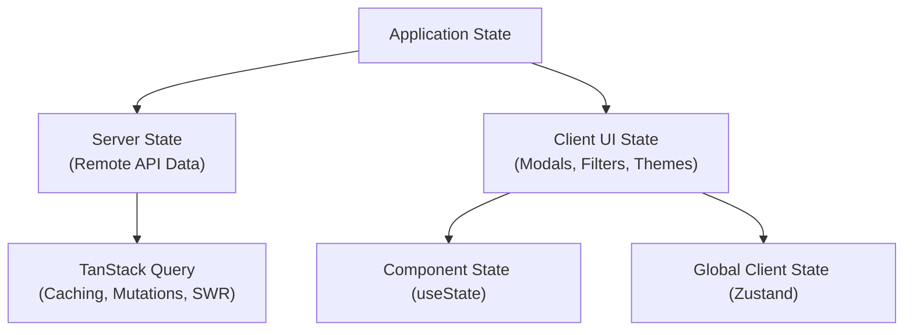

# State Management & API Layer Guidelines

Standards for server state vs. client state separation, TanStack Query, Zustand stores, and centralized API communication.

---

## 1. State Separation Principles



1. **Server State**: Data originating from backend APIs. Handled exclusively by **TanStack Query (React Query)** for caching, invalidation, deduplication, and loading states.
2. **Client State**: Transient UI state (open modal, active tab, selected filter, sidebar collapse). Handled by `useState` (local) or **Zustand** (cross-feature global).

---

## 2. Server State with TanStack Query

* Standardize query keys using tuples: `['feature', 'resource', id]`.
* Isolate query and mutation definitions inside feature hooks.

```typescript
// src/features/todos/hooks/useTodos.ts
import { useQuery, useMutation, useQueryClient } from '@tanstack/react-query';
import { todoService } from '../services/todoService';

export const TODO_KEYS = {
  all: ['todos'] as const,
  detail: (id: string) => ['todos', id] as const,
};

export function useTodos() {
  const queryClient = useQueryClient();

  const todosQuery = useQuery({
    queryKey: TODO_KEYS.all,
    queryFn: todoService.listTodos,
  });

  const createMutation = useMutation({
    mutationFn: todoService.createTodo,
    onSuccess: () => {
      queryClient.invalidateQueries({ queryKey: TODO_KEYS.all });
    },
  });

  return {
    todos: todosQuery.data ?? [],
    isLoading: todosQuery.isLoading,
    createTodo: createMutation.mutateAsync,
  };
}
```

---

## 3. Client State with Zustand

* Use lightweight, modular Zustand stores for cross-component client state.
* Keep store state minimal and normalized; do not duplicate server query cache in Zustand.

```typescript
// src/features/ui/state/useDrawerStore.ts
import { create } from 'zustand';

interface DrawerState {
  isOpen: boolean;
  activeItemId: string | null;
  openDrawer: (id: string) => void;
  closeDrawer: () => void;
}

export const useDrawerStore = create<DrawerState>((set) => ({
  isOpen: false,
  activeItemId: null,
  openDrawer: (id) => set({ isOpen: true, activeItemId: id }),
  closeDrawer: () => set({ isOpen: false, activeItemId: null }),
}));
```

---

## 4. Centralized API Client (`src/core/api/`)

* Centralize base URLs, authentication headers, error interceptors, and timeout configurations.

```typescript
// src/core/api/client.ts
import axios from 'axios';
import { envConfig } from '@/core/config/env';

export const apiClient = axios.create({
  baseURL: envConfig.API_URL,
  timeout: 15000,
  headers: {
    'Content-Type': 'application/json',
  },
});

apiClient.interceptors.request.use((config) => {
  const token = localStorage.getItem('auth_token');
  if (token) {
    config.headers.Authorization = `Bearer ${token}`;
  }
  return config;
});
```
