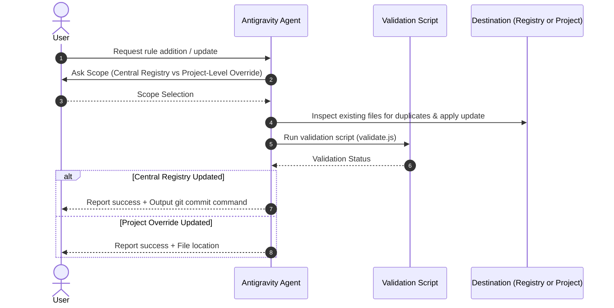

# Manage Guidelines Skill

This skill guides the agent through safely evolving architectural guidelines without causing version drift, syntax errors, or scope confusion.

---

## 1. Guideline Update Workflow



---

## 2. Step-by-Step Execution Protocol

### Step 1: Clarify Scope with the User
If the user hasn't explicitly specified whether the rule is global or project-specific, ask:
> *"Should this guideline be updated in the **Central Registry** (shared across all projects) or as a **Project-Level Override** (local to this project only)?"*

### Step 2: Locate the Target File
- **Central Registry Target**:
  - `agents-hub/plugins/<stack>/rules/<topic>.md` (e.g. `clean_architecture.md`, `riverpod_standards.md`, `nextjs_conventions.md`).
- **Project-Level Target**:
  - `<project_root>/.agents/rules/project_overrides.md`.

### Step 3: Check for Redundancies & Format the Rule
- Read the existing file first.
- Ensure the new rule has:
  1. Clear, concise imperative instructions.
  2. Concrete **✅ Good** and **❌ Bad** code examples.
  3. No conflicting statements with existing rules.

### Step 4: Validate Changes
Run the validation script to verify manifest and markdown integrity:
```bash
node tools/cli/bin/agents-hub.js validate
# or inside the skill:
node skills/manage-guidelines/scripts/validate.js
```

### Step 5: Notify and Provide Git Commands
If updating the Central Registry, provide the ready-to-run Git command:
```bash
git -C /Users/manesh/Documents/Projects/agents-hub commit -am "feat(<stack>): update <topic> guideline"
```
